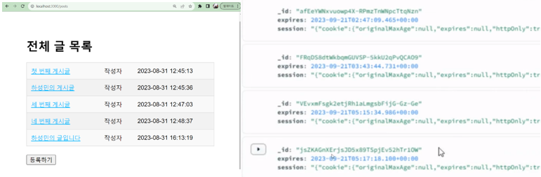

  

<!-- ABOUT THE PROJECT -->
## About The Lecture

일반인을 대상으로 Express.js와 MongoDB를 활용한 웹사이트 제작을 강의했습니다. MongoDB 와 Express.js 를 연결하여 사용자들의 정보를 저장합니다. 각 사용자는 만들어진 게시판에서 글을 게시, 수정, 삭제할 수 있으며, 타인의 게시글에 댓글을 게시,삭제 할 수 있습니다.

|#|제목|비고|
|---|---|---|
|01| Express.js와 MongoDB |Template Engine, CRUD|
|02| MongoDB와 Mongoose ||
|03|회원가입|Passport, Session|
|04|고도화|JWT, OAuth, Nginx|

해당 repository는 강의에 사용된 코드자료입니다.

### 강의자료 예시

&nbsp;
